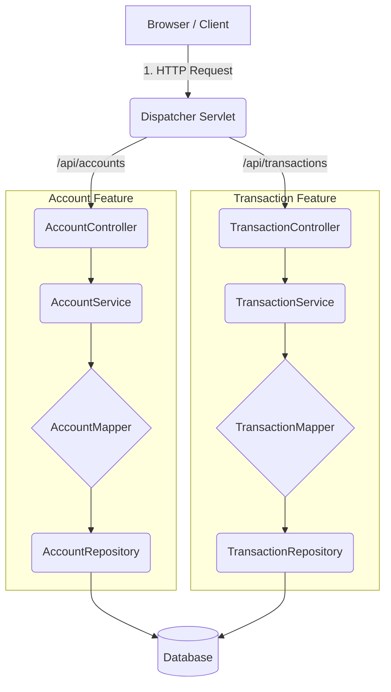

# 03 - The Request Lifecycle Map

Understanding how a request travels through all these files is the key to mastering Spring Boot. Here is the visual map of what happens when you create a new account.

## 1. The Visual Flow

## 2. Step-by-Step Breakdown

### Phase 1: The Request (Downwards)
1. **The Client**: Sends an HTTP request.
2. **The DispatcherServlet**: The **Grand Central Station**. This is the hidden entry point of every Spring Boot app. It looks at the URL (e.g., `/api/accounts`) and asks: *"Which Controller is registered for this path?"*
3. **The Controller**: The "Bouncer". Once the DispatcherServlet finds it, the Controller receives the data and converts it into an `AccountRequest` DTO.
3. **The Service**: The "Brain". It receives the `AccountRequest` from the Controller and decides what to do with it.
4. **The Mapper**: The "Translator". The Service asks the Mapper: *"Hey, turn this Request object into a Database Entity (Account.java)."*
5. **The Repository**: The "Librarian". It takes the Entity and saves it into the database using SQL.

### Phase 2: The Response (Upwards)
6. **The Database**: Confirms the data is saved and returns the new row (with its ID).
7. **The Repository**: Passes the saved `Account` Entity back to the Service.
8. **The Mapper**: The Service again asks the Mapper: *"Now turn this saved Entity into an AccountResponse object for the user."*
9. **The Controller**: Receives the `AccountResponse` from the Service.
10. **The Client**: Receives the final JSON back (now including the `id`).

## 3. Why so many steps?
- **Separation of Concerns**: Each file has **only one job**. 
- If the database changes, only the **Repository** and **Entity** care.
- If the API format changes, only the **Controller** and **DTO** care.
- If the business rules change, only the **Service** cares.

---

## Exercise:
Trace the flow of a **DELETE** request. Does it need a Mapper? Does it need a Response DTO?
