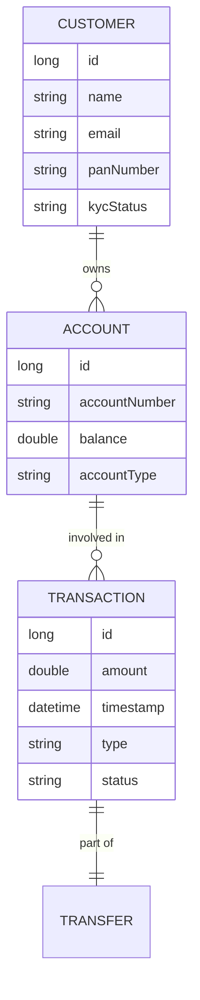

# 01 - Banking App: High-Level Architecture

Building a real-world banking app requires a strong foundation. We are moving from a simple CRUD to a **System Design** approach.

## 1. Domain Entities & Relationships
We have four core pillars in our system. Here is how they connect:

## 2. The Core Modules

### A. Customer Module (The "Who")
- **Responsibility**: Manages personal data and KYC.
- **Classes**: `Customer`, `CustomerRepository`, `CustomerService`, `CustomerController`.
- **Key Logic**: KYC verification status must be `VERIFIED` before an account can be opened.

### B. Account Module (The "Where")
- **Responsibility**: Manages balances and account types.
- **Classes**: `Account`, `AccountRepository`, `AccountService`, `AccountController`.
- **Key Logic**: Every account must be linked to a `Customer`.

### C. Transaction Module (The "History")
- **Responsibility**: An immutable record of every penny that moves.
- **Classes**: `Transaction`, `TransactionRepository`, `TransactionService`.
- **Key Logic**: Transactions should **never** be deleted or updated. They are the "Source of Truth".

### D. Transfer Module (The "How")
- **Responsibility**: Coordinates complex money movements (Internal vs. External).
- **Classes**: `TransferService`, `ExternalBankAdapter`.
- **Key Logic**: This module talks to both the `Account` and `Transaction` modules to ensure money is debited from one and credited to another safely.

## 3. Proposed API Endpoints

| Feature | Method | Endpoint | Description |
| :--- | :--- | :--- | :--- |
| **KYC** | `POST` | `/api/customers` | Register a new person. |
| | `PATCH` | `/api/customers/{id}/kyc` | Update KYC status. |
| **Accounts**| `POST` | `/api/accounts` | Open account for verified customer. |
| | `GET` | `/api/accounts/{id}` | Check balance. |
| **Transfers**| `POST` | `/api/transfers/internal` | Move money between bank accounts. |
| | `POST` | `/api/transfers/external` | Send money to another bank. |
| **History** | `GET` | `/api/accounts/{id}/statement`| View transaction history. |

## 4. The Transfer Intuition
When you transfer money from **Account A** to **Account B**:
1. **Validate**: Does A have enough money? Is B active?
2. **Debit A**: Subtract money from A's balance.
3. **Credit B**: Add money to B's balance.
4. **Log**: Create a `TRANSACTION` record for both A (Debit) and B (Credit).
5. **Atomic**: Either all these steps happen, or **none** of them happen (this is called a "Transaction" in database terms).

---

## Exercise:
Think about "External Transfers". If you send money to another bank, we can't "Credit B" because B is in a different database. How would the logic change?
