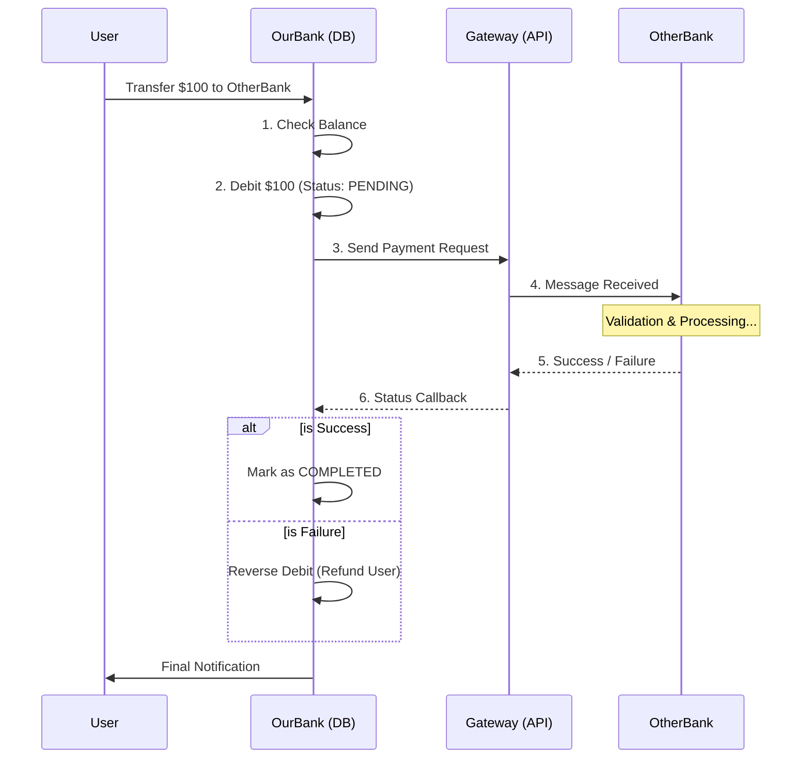

# 02 - Solving the "External Transfer" Problem

When you send money to someone in the **same bank** (Internal), we just update two rows in our database. It's fast and easy.

But when you send money to **another bank** (External), we lose control. We can't reach into their database and add money. This is where the logic changes completely.

## 1. The Strategy: "Trust but Verify"
Since we can't do a single atomic transaction across two banks, we use a workflow called a **Saga** (or a Compensating Transaction).

### The Steps:
1. **Debit & Hold**: We subtract the money from **Account A** immediately and move it to our bank's **"Suspense Account"** (a temporary bucket).
2. **The Messenger (Gateway)**: We send a digital message to the other bank (via a network like ACH, SWIFT, or a custom API).
3. **The Waiting Game**: The transaction status becomes `PENDING`. We don't know yet if the other bank accepted it.
4. **The Final Answer**:
   - **Success**: The other bank confirms receipt. We mark the transaction as `COMPLETED`. The money stays in the suspense account until our bank actually sends the cash to the other bank at the end of the day.
   - **Failure**: The other bank rejects it (e.g., "Account not found"). We must do a **Compensating Transaction**—we take the money back from the suspense account and put it back into **Account A**.

## 2. Visual Flow

## 3. New Architectural Components
To handle this, we need:
- **`ExternalTransferGateway`**: An interface that talks to other banks.
- **`TransitAccount`**: A special account in our database that acts as a "waiting room" for money leaving the bank.
- **`ScheduledTask`**: Sometimes the other bank takes hours to reply. We need a background process that "polled" or waits for updates.

## 4. Why is this important?
This is exactly how real-world systems work. It handles **Network Failures**. If the internet goes down in Step 4, our bank still has the record that the money is "On its way" and won't let the user spend it twice!

---

## Exercise:
Imagine the internet cuts out *after* we debit the user but *before* we send the message to the other bank. What should our `ScheduledTask` do when the internet comes back?
