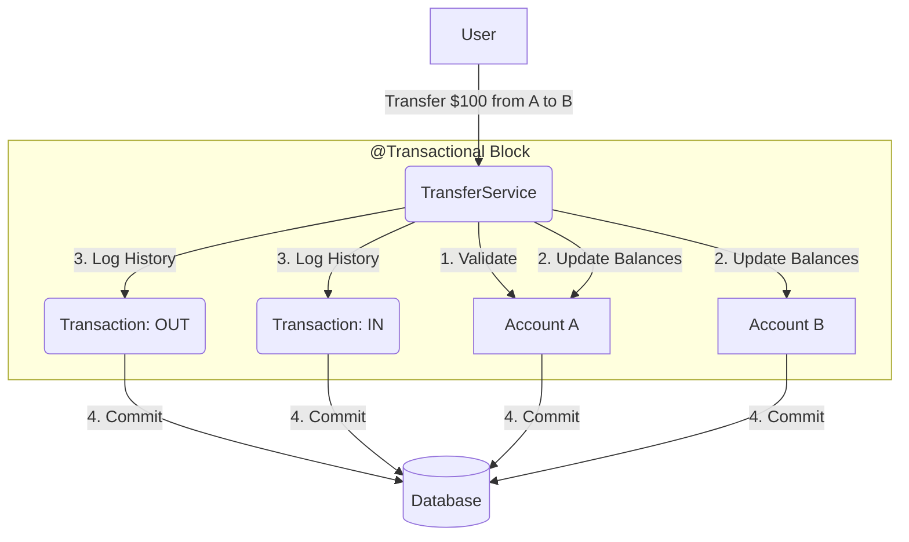

# 03 - Transaction and Transfer Service Flow

In our banking app, moving money isn't just about updating a balance. It's about maintaining a **History (Audit Trail)** that can never be faked or deleted.

## 1. The Relationship
- **`TransferService`**: The **Action**. It coordinates the movement of money between two accounts.
- **`Transaction`**: The **Record**. It is the immutable proof that money moved.

## 2. The Step-by-Step Flow
When `transferService.transferInternal(A, B, $100)` is called, here is what happens inside the `@Transactional` block:

### Step 1: Validation
The Service fetches Account A and Account B. It checks if Account A actually has $100. If it doesn't, it throws an error and **stops immediately**.

### Step 2: Balance Update (In Memory)
It subtracts $100 from A and adds $100 to B. At this point, the database hasn't changed yet; the changes are only in the computer's memory.

### Step 3: Logging the Audit Trail
This is the most important part. We create **two** Transaction records:
1. **Debit Record**: Linked to Account A (Type: `TRANSFER_OUT`, Amount: $100).
2. **Credit Record**: Linked to Account B (Type: `TRANSFER_IN`, Amount: $100).

### Step 4: The Commit
Once everything is done, the method finishes. Spring tells the Database: *"Okay, make all these changes permanent now."*

## 3. Visualizing the Flow

## 4. What if something goes wrong?
Imagine the power goes out *after* Step 2 but *before* Step 3. 
- **Without `@Transactional`**: Account A would lose $100, but Account B might never get it, and there would be no record of where it went!
- **With `@Transactional`**: The database says: *"Wait, the whole method didn't finish. I'm going to ignore everything that happened in this block."* The balances of A and B remain exactly as they were before the call.

---

## Exercise:
Why do we create **two** transactions instead of just one? Hint: If you look at your own bank statement, do you see your transfers? Does the person you sent money to see them?
