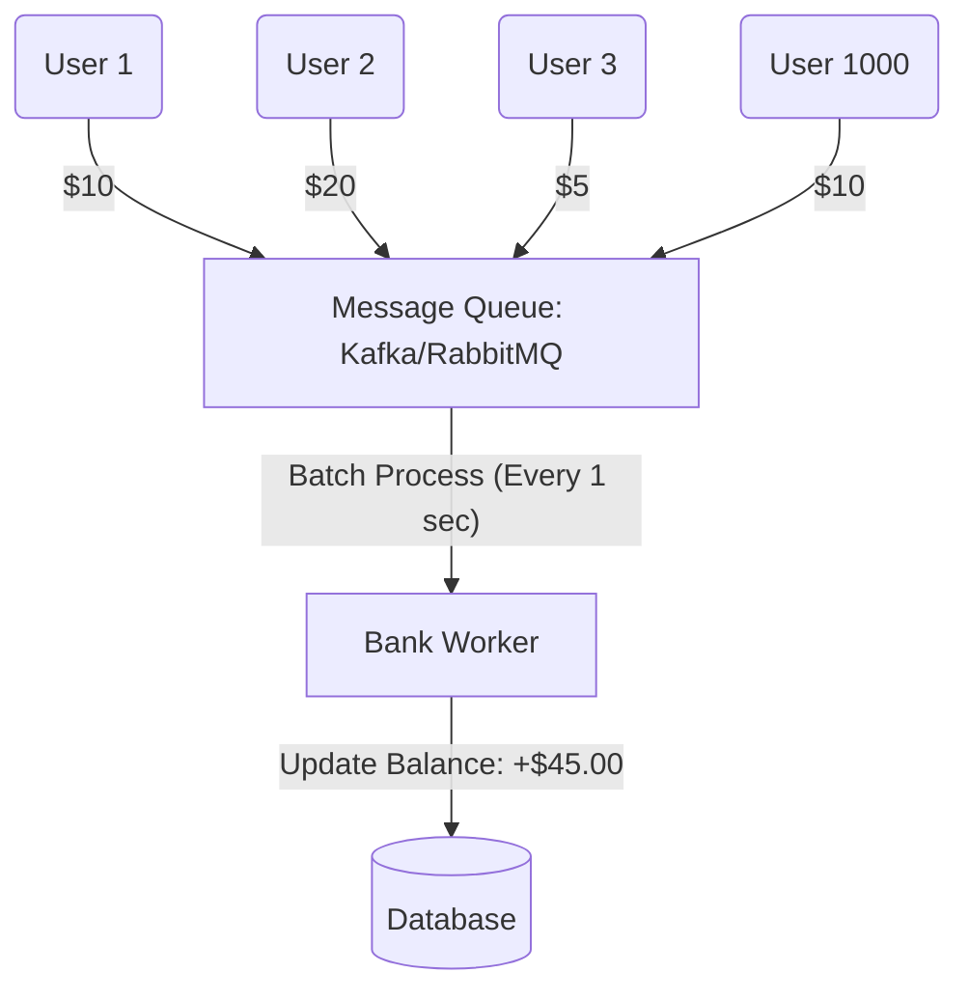

# 03 - Advanced Concurrency: Beyond the Basics

Concurrency isn't just for banks. It's for **Twitter** (millions of likes on one tweet), **Amazon** (thousands of people buying the last iPhone), and **Ticketmaster** (concert tickets).

## 1. Deep Dive: JPA Lock Modes
When you use Spring Data JPA, you can choose exactly how "Aggressive" your locking should be.

| Lock Mode Type | Level | How it works |
| :--- | :--- | :--- |
| **`NONE`** | 0 | No locking. Race conditions are guaranteed. |
| **`OPTIMISTIC`** | 1 | Uses a `@Version` column. Fails if someone else updated the row. |
| **`OPTIMISTIC_FORCE_INCREMENT`** | 2 | Forces the version to increase even if you only read the data. Useful for parent-child relationships. |
| **`PESSIMISTIC_READ`** | 3 | Shares the row. Others can **read** it, but no one can **write** to it until you are done. |
| **`PESSIMISTIC_WRITE`** | 4 | Total Lockdown. No one can read or write. It's the safest but slowest. |

---

## 2. The "Hot Account" Challenge
**Problem**: How do you handle 1000 people trying to update the **same account** at the same time?
If you use **Optimistic Locking**, 999 people will get an error (Version Mismatch).
If you use **Pessimistic Locking**, the 1000th person will have to wait for 999 people to finish. It will be extremely slow.

### The Solution: "The Queue & Batch" Strategy
Instead of hitting the Database 1000 times, we use an **Asynchronous Queue**.

**Why this is fast**: The Database only sees **one** update command (`Total + $45`) instead of 1000 individual commands. This is how large-scale systems (like Stock Exchanges) handle millions of orders.

---

## 3. The "Sharded Balance" Strategy (Ultra-Scalable)
Another professional trick is to break the account balance into **shards**.

**Concept**: Instead of one row for "Account 1", you have 10 rows for "Account 1 - Shard A, B, C...".
1. When User 1 sends money, we randomly pick **Shard A** and update it.
2. When User 2 sends money, we pick **Shard C**.
3. **Result**: Contention is reduced by 10x!
4. **Total Balance** = `SUM(Shard A + Shard B + Shard C...)`.

---

## 4. Summary: The Scalability Ladder
1. **Low Traffic**: No Locking (Dangerous).
2. **Medium Traffic**: Optimistic Locking (`@Version`).
3. **High Traffic**: Pessimistic Locking (Safest).
4. **Extreme Traffic**: Message Queues & Batching (The Professional Way).

---

## Exercise:
If you were building a "Like" button for Instagram, which locking strategy would you use? 
Hint: Does it matter if a "Like" is delayed by 1 second?
