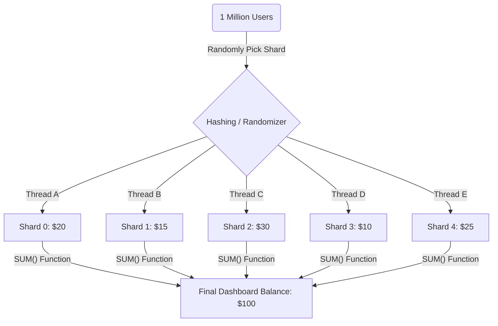

# 04 - Interview Prep: Balance Sharding (Scalable Balance)

In a System Design interview, if you are asked: *"How do you handle a viral celebrity account getting 1 million donations in 1 minute?"*, the answer is **Balance Sharding**.

## 1. The Simple Intuition: The "Piggy Bank" Analogy

### The Problem: The "Single Slot" Piggy Bank
Imagine a giant **Piggy Bank** representing a bank account. 
*   It has only **one narrow slot** at the top.
*   If 100 people want to drop a coin at the same time, they must wait in a long line.
*   **Result**: A "Traffic Jam" (Database Lock). Only 1 person can update the balance at a time.

### The Solution: The "10-Bank" System
Instead of one giant bank, we give you **10 smaller piggy banks**.
*   Now, 10 people can drop coins into 10 different banks **at the exact same time**.
*   **Result**: No more waiting! You just increased your speed by 10x.

---

## 2. How it Works (The Technical Flow)

### A. The "Write" Flow (Collecting Money)
When someone sends money to the account, the system **randomly picks** one of the 10 shards (piggy banks) and updates its balance.
- **Thread 1**: Updates Shard 3.
- **Thread 2**: Updates Shard 7.
- **Thread 3**: Updates Shard 3 (small wait, but much rarer).

### B. The "Read" Flow (Checking the Total)
To find the final balance, the system simply "opens" all 10 banks and adds them up:
`Total Balance = Shard 1 + Shard 2 + ... + Shard 10`.

---

## 3. Visualizing the Sharded Solution

---

## 4. Why is this a "Pro" Move? (Interview Points)

When an interviewer asks you about this, highlight these 3 points:

1. **High Throughput**: You can handle thousands of parallel writes without hitting database lock limits.
2. **Scalability**: If 10 shards aren't enough, you can just add 10 more shards. The system grows with the traffic.
3. **Trade-off (The Catch)**: Tell the interviewer: *"The trade-off is complexity. Calculating the total balance is slightly slower, and checking if a user has 'Negative Balance' is harder because you have to sum all shards first."*

## 5. Summary Table for Interviews

| Feature | Single Row Balance | Sharded Balance |
| :--- | :--- | :--- |
| **Concurrency** | Low (People wait in line) | **High** (People use multiple lines) |
| **Complexity** | Simple | Complex |
| **Use Case** | Normal users | **Hot Accounts** (Celebrities, Viral events) |
| **Principle** | Atomic Update | **Divide and Conquer** |

---

## Exercise:
If you have 100 shards and 100 people send money at once, what is the mathematical probability that two people will fight for the same "Lock"? (Hint: It's much lower than with 1 row!)
